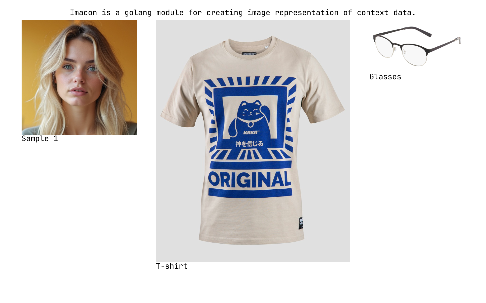

# Imacon



Imacon is a golang module for creating image representation of context data.

This module is built to solve the problem of dynamically generating images that represent various types of context data (text, images) in a image representation format that multimodel AI can use it as context input. 

## Features
- Render text blocks with word wrapping.
- Load and display JPEG and PNG images.
- Auto-tiling of multiple objects to fit within a specified canvas size.
- Waterfall layout for arranging objects efficiently.
- Support for nested panes to create complex layouts.
- Custom canvas size and font settings.

## Installation

```bash
go get github.com/dannykok/imacon
```

## Requirements

- Go 1.24.1 or higher

## Usage

### Basic Example

```go
package main

import (
    "os"
    "github.com/dannykok/imacon"
)

func main() {
    // Create engine with configuration
    eng := imacon.New(imacon.Config{
        MaxCanvasWidth:  2048, // The maximum width of the output image
        MaxCanvasHeight: 2048, // The maximum height of the output image
        FontSize:        32, // optional
    })

    // Scene is the root struct that holds the main Pane struct
    // Create text block
    textBlock := imacon.NewTextBlock("Imacon: Image Representation of Context Data", imacon.TextBlockOpts{TextWrap: true})
    
    // Create pane with objects
    pane := imacon.NewPane([]imacon.Tileable{textBlock}, 0, 0, 0)
    
    // Create scene with main pane
    scene := imacon.NewScene(pane)

    // Render the scene
    canvas, err := eng.Render(&scene)
    if err != nil {
        panic(err)
    }

    // Save to file
    f, _ := os.Create("output.png")
    defer f.Close()
    canvas.ToPng(f)
}
```

### Working with Images

```go
// Load an image
// NewImageBlock accepts an io.Reader which can be a file or network stream
file, _ := os.Open("path/to/image.jpg")
defer file.Close()
imgBlock, _ := imacon.NewImageBlock(file, "My Image")

// Create scene with image with default option values
pane := imacon.NewPane([]imacon.Tileable{imgBlock}, 0, 0, 0)
scene := imacon.NewScene(pane)
```

### Create a auto waterfall layout 

```go
// Imacon automatically tiles multiple objects to fit the canvas
textBlock := imacon.NewTextBlock("Remarks", imacon.TextBlockOpts{})
pane := imacon.NewPane([]imacon.Tileable{
    imgBlock1,
    imgBlock2,
    textBlock,
    imgBlock3,
}, 0, 0, 0)
scene := imacon.NewScene(pane)
```

### Custom Pane layout

For more control over the layout, you can use `NewPaneWithShape` to define a custom column-based layout:

```go
// Create text blocks
title := imacon.NewTextBlock("Character Sheet", imacon.TextBlockOpts{TextWrap: true})
description := imacon.NewTextBlock("Details about the character...", imacon.TextBlockOpts{TextWrap: true})

// Define a custom shape with 3 columns using NewShapeWithObjects
shape := imacon.NewShapeWithObjects([]imacon.Column{
    // First column - text descriptions
    {
        Objects: []imacon.Tileable{title, description},
    },
    // Second column - first set of images
    {
        Objects: []imacon.Tileable{img1, img2},
    },
    // Third column - second set of images
    {
        Objects: []imacon.Tileable{img3, img4},
    },
})

// Create pane with the custom shape
// Parameters: shape, colWidth, colPad, rowPad
pane := imacon.NewPaneWithShape(shape, 480, imacon.DefaultColPad, imacon.DefaultMinPad)
scene := imacon.NewScene(pane)
```

## Testing

```bash
go test -v ./...
```

Test outputs will be saved to `test_output/` directory.

## Dependencies
- [fogleman/gg](https://github.com/fogleman/gg) - for canvas drawing.
